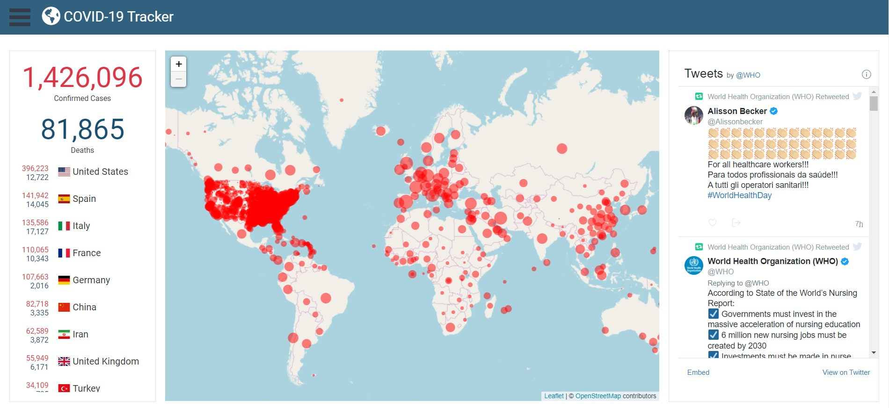
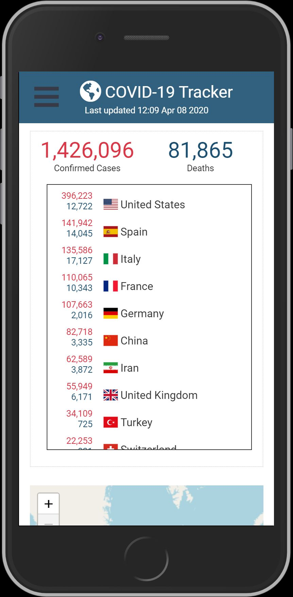

# COVID-19 Tracker

Visualize the rate of infection and spread of the 2019 novel coronavirus (COVID-19).




## Setup

To clone and run this application, you'll need [Git](https://git-scm.com/) and [Node.js](https://nodejs.org/) (which comes with [npm](https://www.npmjs.com/)) installed on your computer. From your command line:

```sh
# Clone this repository
$ git clone https://github.com/andyrutherford/covid19-tracker.git

# Go into the repository
$ cd covid19-tracker

# Install dependencies
$ npm install

# Run the app
$ npm run dev
```

## Tech

COVID19-Tracker uses a number of open source projects to work properly:

- [ReactJS](https://reactjs.org/) - A JavaScript library for building user interfaces
- [jQuery](http://jquery.com) - simplifies HTML document traversing, event handling, animating
- [node.js](http://nodejs.org) - evented I/O for the backend
- [Express](http://expressjs.com) - fast node.js network app framework
- [axios](https://github.com/axios/axios) - Promise based HTTP client for the browser and node.js
- [cheerio](https://github.com/cheeriojs/cheerio) - parse markup for traversing/manipulating data
- [Chart.js](https://www.chartjs.org/) - data visualization
- [React-Leaflet](https://react-leaflet.js.org/) - abstraction of [Leaflet](http://leafletjs.com/) as React components

## Demo

Here is a working live demo : https://coronavirus-covid-19-tracker.herokuapp.com/

## License

MIT
